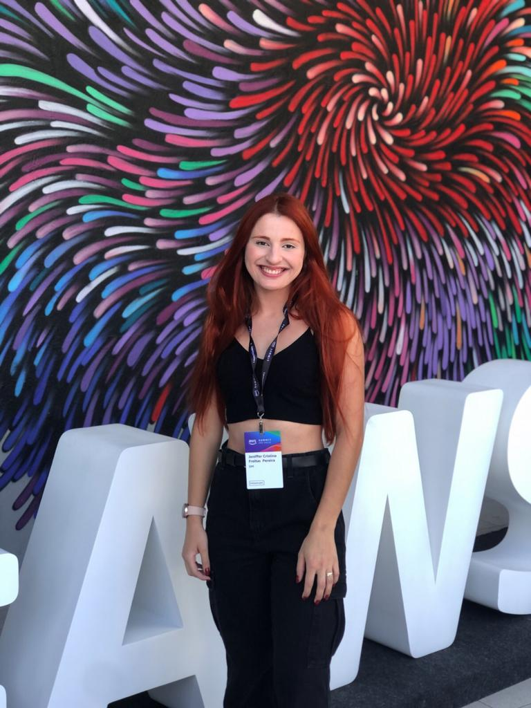

<h1 align="center"> Jeniffer Cristina Freitas Ramos </h1>

 <h3 align="left">✨ Introdução</h3>
 

    
  

Sou aluna do curso de Análise e Desenvolvimento de Sistemas da Faculdade de Tecnologia de São José dos Campos - Prof. Jessen Vidal, e estou cursando o 5º semestre. Minha vida é moldada por paixões, amo meu marido, meus três cachorros, plantas, cuidar da minha casa e estudar. 
  
A minha primeira graduação se iniciou em 2017 no curso de Licenciatura em Química pelo Instituto Federal de São Paulo (IFSP), essa experiência me agregou demasiados conhecimentos e vivências, como participação em congresso, realização de projetos pedagógicos, participação em iniciação científica com estudo de nanopartículas de zircônia na UNIFESP e o estágio aplicando aulas em escolas públicas de ensino médio. Depois, iniciei meu processo de mestrado no INPE, contudo por motivos maiores decidi fazer uma transição de carreira para a área de tecnologia, inspirando-me na carreira do meu marido.
  
Cursando o quarto semestre de ADS, resolvi participar de um processo seletivo de estágio para entrar na instituição financeira DM. O processo contou com 7 etapas, consegui passar por todas e iniciar minha primeira experiência profissional na área. Atualmente, trabalho na área de inovação que tem como foco o produto PIX PARCELADO que se resume em uma alternativa as formas de pagamento tradicionais de compras (dinheiro, cartão de crédito e débito). Esse produto foi e está sendo desenvolvido do zero, assim atuo nas task de front e back-end (tenho mais domínio e preferência por tasks de back). No começo do estágio foi desafiador, pois tive que lidar com tecnologias e linguagens que não tive contato na faculdade, exemplo: Golang, Flutter, HBS, Docker e Kubernetes, NEXT JS (framework para react), banco de dados com arquitetura em grafo (Neptune), arquitetura de micros serviço, GRPC para comunicação entre diferentes sistemas via conexão de rede, além de outros serviços da AWS, Microsoft, Datadog e Keycloak. Além dessas tecnologias que não tinha domínio, tenho contato também com linguagens conhecidas por meio da fatec, como Java, React, Typescript e Python.
  
Sendo assim, para conseguir lidar com tantos recursos tecnológicos, realizei cursos para aprofundar meus conhecimentos:
 | [Formação: Gerencie aplicações react com typescript ](https://cursos.alura.com.br/degree/certificate/ccb135f1-3245-48bd-b166-bc3550e386f9) |
    
  
Este repositório tem como objetivo reunir e documentar todos os projetos de API - Aprendizagem por Projetos Integrados - desenvolvidos durante minha trajetória no curso de Tecnologia em Análise e Desenvolvimento de Sistemas. Colaborei com a construção de cinco projetos, entregues um em cada semestre desde o início da graduação. 
 
 

 
 ##

<h3 align="left">💻 Projetos </h3> 

  
 |   API  |    Descrição    |
 | :------:      | :------: |
 | [1° Semestre](https://github.com/laaridiniz/Portfolio-ADS/tree/main/Projeto-I)   | Website para armazenar os projetos desenvolvidos pelos alunos da FATEC |
 | 2° Semestre   | Aplicação desktop para centralizar troca de informações entre empresa e clientes  | 
 | 3° Semestre   | Aplicação web para cálculo de distância de pouso de aeronaves     | 
 | 4° Semestre   | Plataforma web para gerenciamento de chamados internos   | 
 | 5° Semestre   | Aplicação mobile para cadastro de equipamentos públicos em campo    |

> _Clique em uma das opções acima para ver mais detalhes sobre os projetos desenvolvidos._
 

 ##
 
<h3 align="left">📑 	Conhecimentos Técnicos </h3> 
 <!-- Back-end / Front-end / DevOps -->
   <h4 align="left">Back-end</h4>  
  
 
 

   <h4 align="left">Front-end</h4>  
 
 
 
 
 
 
 

   <h4 align="left">Database</h4>  
 
 
 

   <h4 align="left">Design</h4>  
 
 

 <h4 align="left">Sistemas Operacionais</h4>
 
 
 
 

 <h4 align="left">IDEs</h4>
 
 
 
 

<h4 align="left">Cloud</h4>

<h4 align="left">Outros</h4>

 ##
 
<h3 align="left">✉️ Contatos </h3> 
 
 
   
  
  
   

  
